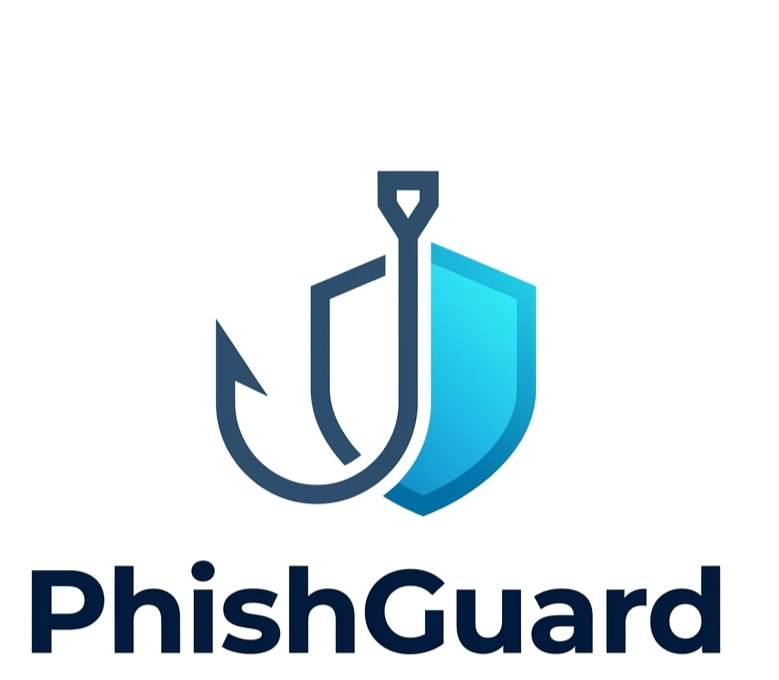

<p align="center">
  
</p>

<h1 align="center">PhishGuard</h1>

<p align="center">
  <b>AI-Powered Phishing URL Detection & Real-Time Threat Intelligence Engine</b>
</p>

<p align="center">
  <a href="https://phishguard.co.in"><strong>🌐 Live Web Application »</strong></a>
  <br />
  <br />
  <a href="https://github.com/kuldeeptiwari9591-cyber/phishguard-app/issues/new?template=false_positive.md&title=[False+Positive]+URL+Here">Report False Positive</a>
  ·
  <a href="https://github.com/kuldeeptiwari9591-cyber/phishguard-app/issues/new?template=feature_request.md">Request Feature</a>
  ·
  <a href="https://phishguard.co.in">API Documentation</a>
</p>

<p align="center">
  
  
  
  
</p>

---

## 📸 Overview & Interface


**PhishGuard** is a high-performance web security platform that analyzes suspicious links, detects brand impersonation, and prevents zero-day social engineering attacks in real time.

Unlike traditional security solutions that rely exclusively on static, slow-to-update blocklists, PhishGuard uses a **dual-engine detection strategy**: combining trained machine learning classifiers with **55+ real-time heuristic and forensic checks** to deliver an instant verdict in under 3 seconds.

---

## ⚙️ How PhishGuard Works

PhishGuard employs a multi-layered analysis pipeline on every submitted URL before generating a confidence score and verdict.


```
┌──────────────────────────────┐
│      Incoming URL Input      │
└──────────────┬───────────────┘
                │
                ▼
┌────────────────────────────┐
│   URL Normalization Engine │
└─────────────┬──────────────┘
              │
   ┌──────────┴──────────┐
   ▼                     ▼
┌───────────────────────────┐   ┌───────────────────────────┐
│ Machine Learning Pipeline │   │ Heuristic Forensic Engine │
├───────────────────────────┤   ├───────────────────────────┤
│ • XGBoost Classifier      │   │ • Domain Age & WHOIS      │
│ • Character Entropy       │   │ • SSL Cert Validation     │
│ • Typosquatting Patterns  │   │ • Homograph Attack Check  │
│ • Path & Query Analysis   │   │ • Brand Impersonation     │
└─────────────┬─────────────┘   └─────────────┬─────────────┘
              │                               │
              └───────────────┬───────────────┘
                              │
                              ▼
                ┌───────────────────────────┐
                │ Risk Scoring Engine       │
                │ (0 - 100 Threat Index)    │
                └─────────────┬─────────────┘
                              │
        ┌─────────────────────┼─────────────────────┐
        ▼                     ▼                     ▼
┌─────────────────┐   ┌─────────────────┐   ┌─────────────────┐
│    LOW RISK     │   │   SUSPICIOUS    │   │  CRITICAL RISK  │
│ (Likely Safe)   │   │ (Proceed         │   │ (Malicious Trap)│
│                 │   │  Carefully)      │   │                 │
└─────────────────┘   └─────────────────┘   └─────────────────┘
```

---

## 🔍 Key Features

### 1. Predictive AI Threat Engine
* **Trained on 800,000+ Real-World URLs:** High accuracy across legitimate, phishing, malware, and spam endpoints.
* **Zero-Day Detection:** Flags newly registered malicious URLs before they are added to public blacklist databases (Google Safe Browsing, VirusTotal, etc.).

### 2. Multi-Layered Forensic Security Checks (55+ Rules)
* **Brand Impersonation Detection:** Identifies deceptive subdomains or lookalike domains mimicking major financial, social, and tech brands.
* **Homograph & Typosquatting Analysis:** Detects internationalized domain names (IDN) with Cyrillic/Greek character substitution traps.
* **SSL & Security Record Audit:** Checks SSL validity, certificate issuer age, SPF, and DMARC DNS records.
* **URL Entropy Scoring:** Evaluates randomized parameter strings commonly used in unique phishing campaign links.

### 3. Real-Time Scan History & Dashboard
* **Instant Tracking:** Keep track of past URL analyses with visual risk indicators, timestamping, and categorization.
* **Filter & Search:** Sort through past scans by risk severity (`Safe`, `Medium`, `Critical`).


---

## 🛠️ Technology Stack

| Layer | Technologies Used |
| :--- | :--- |
| **Frontend UI** | HTML5, CSS3, Modern JavaScript (Vanilla ES6+), Inter Font System |
| **Backend API** | Python, Flask REST API, Gunicorn |
| **Machine Learning** | Scikit-Learn, XGBoost, NumPy, Pandas |
| **Security & DNS** | Python-Whois, PyOpenSSL, Dnspython, tldextract |
| **Authentication** | Firebase Web SDK (Google Auth) |
| **Deployment** | Vercel (Frontend) / Render (API Service) |

---

## 📊 Detection Logic & Risk Breakdown

PhishGuard categorizes threat levels into three clear tiers based on combined confidence scoring:

| Risk Level | Threat Score | Indicator Summary | Recommended Action |
| :--- | :---: | :--- | :--- |
| 🟢 **LOW RISK** | `0 - 25` | Valid SSL, established domain age (>1 year), clear DNS, clean ML score. | Safe to visit. |
| 🟡 **SUSPICIOUS** | `26 - 65` | Recent domain registration, missing DMARC records, elevated URL entropy. | Do not enter sensitive credentials. |
| 🔴 **CRITICAL RISK** | `66 - 100` | Brand impersonation detected, invalid/expired SSL, known phishing heuristics. | **Block immediately.** Do not click. |

---

## 🚀 Live Demo & Usage

1. Open your browser and navigate to **[phishguard.co.in](https://phishguard.co.in)**.
2. Paste any link received via SMS, WhatsApp, email, or social media into the scan field.
3. Click **Scan Now**.
4. Review the full forensic diagnostic breakdown, including domain age, WHOIS information, and risk indicators.

---

## 🛡️ False Positive & Security Reporting

We aim for continuous model refinement and detection accuracy.

* **Reporting False Positives / False Negatives:**
  If a safe URL was flagged as malicious, or a phishing link was missed, please **[Open a GitHub Issue](https://github.com/kuldeeptiwari9591-cyber/phishguard-app/issues/new?template=false_positive.md)** with the link details.
* **Responsible Disclosure:**
  To report security vulnerabilities regarding the PhishGuard infrastructure, please contact us via the support portal at [phishguard.co.in](https://phishguard.co.in).

---

## 📄 License & Disclaimer

This project is released under the **MIT License**.

> **Disclaimer:** PhishGuard is an advisory threat intelligence tool designed to assist users in identifying suspicious web links. While our machine learning models and heuristic engines maintain high accuracy, no automated tool can guarantee 100% detection of all cyber threats. Always exercise caution when entering sensitive personal or financial information online.

---

<p align="center">
  <b>PhishGuard</b> — <i>Scan Before You Click.</i>
</p>
